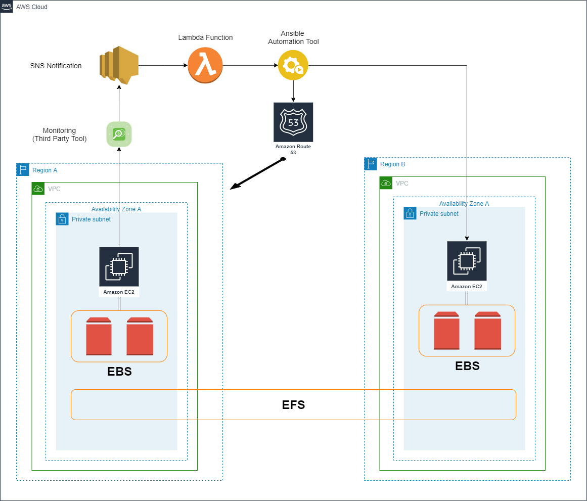

# Postgresql REST Api 

## Multi-Region REST API example.

The api and the database are EC2 installed (non-aws rds, non-aws api gateway). It's a simple python flask api pointing a local postgresql database. It will switchover to a different region in case of an outage. 
The idea behind this architecture is to show the switch to a different region (this could have been multi-az api also but this option would have been more simpler since most of the AWS services support multi-AZ option -load balancers, api gateway, route 53, etc.-). 

### Pre-requisites

1. install following packages:
```
dnf install libpq-devel  #to avoid psycopg python module error at install
```

2. install following Python modules:
```
pip3 install flask flask_sqlalchemy flask-migrate psycopg2 
```


### Test
 
1. clone this repository

2. create database, role & tables
```
psql -f apistest_db.sql
```

3. add this line to you pg_hba.conf
```
echo "local  all  apitest  password" >> /var/lib/pgsql/data/pg_hba.conf
```

4. run the api:
```
cd api
run flask
```

5. test the api (Available names: John, Jane & Robert):
```
curl --request GET --header "Content-Type: application/json" http://localhost:1234/hello/John
curl --request PUT --header "Content-Type: application/json" --data '{ "dateOfBirth": "2021-12-03" }' http://localhost:1234/hello/John
```


### Architecture Diagram



The api & database run in an ec2 instance with a multi-region EFS for store the backups & wal's. Route 53 for DNS resolution. 
The DR instance is a replica from primary site instance: same users, packages, directories structure, etc.

In case of primary database outage:

1. the monitoring tool will invoke a lambda function with an sns notification.
2. the lambda function will run remotely Ansible scripts from another ec2 instance pointing to DR instance
3. Ansible scripts will do the database restore using the backup & wal's in EFS fs, api files restore from github and Route 53 dns update pointing to the DR site.


### No-Downtime Production Deployment

1. run ansible playbook against the DR instance to restore database & api (to keep it simple, this was tested using root user. A better option would be a user with sudo privileges):
```
cd ansible
ansible-playbook -i </path/to/prod_inventory> main_restore.yml
```

- Ansible Directory Layout
```
ansible
├── ansible.cfg
├── main_backup.yml
├── main_restore.yml
├── prod_inventory
└── roles
    ├── api_restore
    │   ├── defaults
    │   │   └── main.yml
    │   └── tasks
    │       └── main.yml
    ├── db_backup
    │   ├── defaults
    │   │   └── main.yml
    │   └── tasks
    │       └── main.yml
    └── db_restore
        ├── defaults
        │   └── main.yml
        └── tasks
            └── main.yml
```
